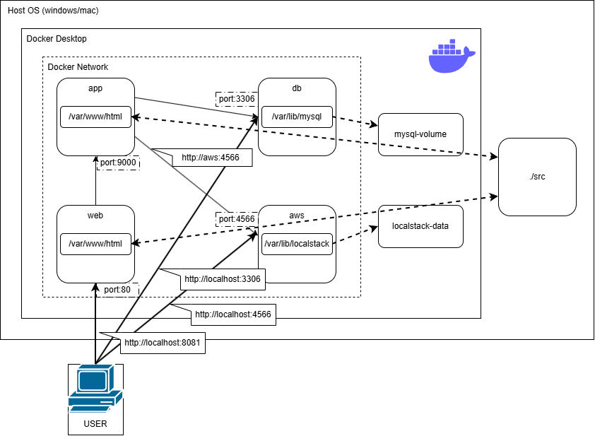

# LEMP Stack with Laravel(docker environment)
## １．プロジェクト概要
自作の開発環境（LEMP + Laravel + LocalStack）をベースに、AWSの機能を使用した、画像保存・加工・共有アプリを作成する学習用プロジェクトです。

## ２．ディレクトリ構成
```
.
│  .env.example                 #   .envファイル作成用テンプレート
│  .gitattributes
│  .gitignore
│  docker-compose.yml
│  README.md
│  setup.sh
│  
├─docker
│  ├─app     
│  ├─aws
│  ├─db    
│  └─web        
├─EXAMPLES
│      .env.laravel.example     #   Laravelの.envへの転記用ファイル
│      web.php                  #   EXAMPLESディレクトリ内のファイルはsetup.shで使います
│      welcome.blade.php
│      
└─images
        LEMP_Laravel_test.png
```

## ３．セットアップ手順
以下の手順を実行することで、ローカル環境にLaravel+LocalStack（S3, RDS）環境を立ち上げます。

1. リポジトリのクローン
    ```
    $ git clone https://www.github.com/ykamio3872-max/LEMP_Laravel_test.git
    $ cd LEMP_Laravel_test
    ```
2. 環境変数の設定\
`.env.example`に以下の値を入力し、ファイル名を`.env`に変更してください。

    ```
    DB_DATABASE=laravel_db
    DB_USERNAME=user 
    DB_PASSWORD=password 
    DB_ROOT_PASSWORD=password

    AWS_ACCESS_KEY_ID=test
    AWS_SECRET_ACCESS_KEY=test 
    AWS_DEFAULT_REGION=ap-northeast-1
    AWS_USE_PATH_STYLE_ENDPOINT=true
    AWS_ENDPOINT=http://aws:4566
    AWS_LOCAL_ENDPOINT=http://aws:4566

    LOCALSTACK_SERVICES=s3,rds

    AWS_URL=http://localhost:4566/my-test-bucket
    ```

3. コンテナの起動と自動インストール

    docker engineが起動していることを確認の上で、ホストOSごとに以下の手順を実行してください。

- **For Mac/Linux**\
ディレクトリのルートで以下のコマンドを実行してください。

    ```bash
    $ chmod +x setup.sh
    $ ./setup.sh
    ```
- **For Windows**\
Windowsでは、Gitをインストールした際に一緒に導入される**Git Bash**を使用して実行することを推奨します。
     1. プロジェクトのルートディレクトリで右クリックし、**Git Bash Here**を選択します。
     2. 以下のコマンドを実行してください。

    ```bash
    $ sh setup.sh
    ```
- [!NOTE]Windowsの標準コマンドプロンプトやPowerShell上で直接`./setup.sh`は動作しません。\
必ず`Git Bash`または`WSL2`上のターミナルを使用してください。

## 4. 動作確認
* **Webサイト**:`http://localhost:8081`(環境によりポートは異なります)
* **MYSQL直接接続**:
    ```
    $ docker compose exec db mysql -u root -p
    ```
    パスワードは`.env`で指定した`DB_ROOT_PASSWORD`が必要です。
* **AWS動作確認**: `http://localhost:8081/s3-upload-test` \
    バケット作成に成功しているとjson形式で情報が表示されます。

## 5. システム構成図



## 6. トラブルシューティング・注意事項

* **Q. `src`が空ではないというエラーでインストールが止まる**\
    Laravelの自動インストールは、`src`内に`artisan`ファイルがない場合のみ実行されます。`.gitkeep`などの隠しファイルが存在しても一時ディレクトリを経由してインストールされるよう `entrypoint.sh`で制御していますが、失敗する場合は一度`src`内を空にして再試行してください。

* **Q. データベース接続エラー (Unknown database)**\
    ルートの `.env`と`src/.env`のDB名が食い違っている可能性があります。両者を修正した後、以下のコマンドでボリュームをリセットして再起動してください。
    ```
    $ docker compose down -v
    $ docker compose up -d
    ```
* **Q. `vendor/autoload.php`がないというエラーが出る**\
    `composer install`が完了していない可能性があります。`$ docker compose exec app composer install`を手動で実行してください。

## 7. 技術スタック
* **Infrastructure**: Docker Compose
* **Server**: Nginx(Web), PHP 8.1-fpm(App), MySQL 8.0(DB)
* **Framework**: Laravel 8.x
* **LocalStack**: LocalStack 3.4.0

    いずれも前プロジェクトで検証済みの安定版を使用。

## 8. 更新履歴
* **2026-04-13**: リポジトリ作成

## 9. ライセンス

このプロジェクトは **MITライセンス** のもとで公開されています。詳細については、プロジェクト内に同梱されている [LICENSE](./LICENSE) ファイルを参照してください。

## 10. リンク
* 自作の開発環境構築プロジェクトへのリンク\
    `https://www.github.com/yskamioyc-cmyk/LEMP_Laravel_test.git`