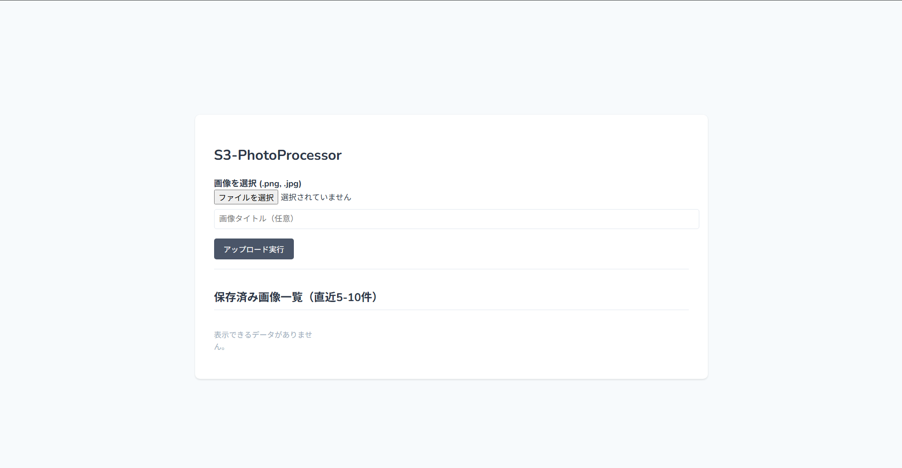
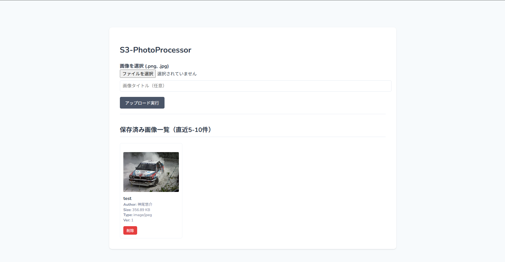

# S3-PhotoProcessor (LEMP + Laravel + LocalStack environment)
## １．プロジェクト概要
自作の開発環境（LEMP + Laravel + LocalStack）をベースに、AWSの機能を使用した、画像保存・加工・共有アプリを作成する学習用プロジェクトです。

### a. 主な機能・システム概要
* **S3画像アップロード**: 大容量データをAWS S3(現状ではLocalStack)で効率的に管理。
* **画像加工エディタ**: ブラウザ上でのリサイズ・フィルタ加工機能。
* **加工履歴管理**: 1つの元画像に対して複数の加工バリエーションを保存。
* **タグ付け検索**: 中間テーブルを用いた、高速な画像タグ検索機能。

### b. ドキュメントへのリンク
本プロジェクトでは、実装前に詳細な設計を行っています。
* [要件定義書](./docs/requirements.md) - プロジェクトの目的・機能/非機能要件の定義
* [画面遷移図](./docs/basic-design/screen-transition/screen-transition-diagram.md) - アプリの全体フロー
* [データベース設計](./docs/basic-design/database-design.md) - 各テーブルの詳細定義
* [画面仕様書](./docs/basic-design/screen-specifications) - 各画面の詳細な構成

## ２．ディレクトリ構成
```
.
|-- EXAMPLES
|   |-- web.php
|   `-- welcome.blade.php
|-- LICENSE
|-- README.md
|-- docker
|   |-- app
|   |-- aws
|   |-- db
|   `-- web
|-- docker-compose.yml
|-- docs
|   |-- basic-design    # 基本設計書
|   |-- images
|   `-- requirements.md     # 要件定義書
|-- images
|   |-- LEMP_Laravel_test.png
|   |-- S3-PhotoProcessor.png
|   `-- er-test.png
|-- setup.sh
`-- src
```

## ３．セットアップ手順
以下の手順を実行することで、ローカル環境にLaravel+LocalStack（S3, RDS）環境を立ち上げます。

1. リポジトリのクローン
    ```
    $ git clone https://www.github.com/yskamioyc-cmyk/S3-PhotoProcessor.git
    $ cd S3-PhotoProcessor
    ```
2. 環境変数の設定\
`.env.example`に以下の値を入力し、ファイル名を`.env`に変更してください。

    ```
    DB_DATABASE=laravel_db
    DB_USERNAME=user 
    DB_PASSWORD=password 
    DB_ROOT_PASSWORD=password

    AWS_ACCESS_KEY_ID=test
    AWS_SECRET_ACCESS_KEY=test 
    AWS_DEFAULT_REGION=ap-northeast-1
    AWS_USE_PATH_STYLE_ENDPOINT=true
    AWS_ENDPOINT=http://aws:4566
    AWS_LOCAL_ENDPOINT=http://aws:4566

    LOCALSTACK_SERVICES=s3,rds

    AWS_URL=http://localhost:4566/my-test-bucket

    ```

3. コンテナの起動と自動インストール

    docker engineが起動していることを確認の上で、ホストOSごとに以下の手順を実行してください。

- **For Mac/Linux**\
ディレクトリのルートで以下のコマンドを実行してください。

    ```bash

    $ chmod +x setup.sh
    $ ./setup.sh

    ```
- **For Windows**\
Windowsでは、Gitをインストールした際に一緒に導入される**Git Bash**を使用して実行することを推奨します。
     1. プロジェクトのルートディレクトリで右クリックし、**Git Bash Here**を選択します。
     2. 以下のコマンドを実行してください。

    ```bash

    $ sh setup.sh

    ```
- [!NOTE]Windowsの標準コマンドプロンプトやPowerShell上で直接`./setup.sh`は動作しません。\
必ず`Git Bash`または`WSL2`上のターミナルを使用してください。

## 4. 動作確認
* **Webサイト**:`http://localhost:8081`(環境によりポートは異なります)
* 正常に動作している場合、以下の画面が表示されます。

<p align="center">
  
</p>

* 画像アップロードに成功した場合、以下の画面に遷移します。

<p align="center">
    
</p>

* **MYSQL直接接続**:
    ```
    $ docker compose exec db mysql -u root -p
    ```
    パスワードは`.env`で指定した`DB_ROOT_PASSWORD`が必要です。
* **AWS動作確認**: `http://localhost:8081/s3-upload-test` \
    バケット作成に成功しているとjson形式で情報が表示されます。

## 5. システム構成図
<p align="center">
    
</p>

## 6. トラブルシューティング・注意事項

* **Q. `src`が空ではないというエラーでインストールが止まる**\
    Laravelの自動インストールは、`src`内に`artisan`ファイルがない場合のみ実行されます。`.gitkeep`などの隠しファイルが存在しても一時ディレクトリを経由してインストールされるよう `entrypoint.sh`で制御していますが、失敗する場合は一度`src`内を空にして再試行してください。

* **Q. データベース接続エラー (Unknown database)**\
    ルートの `.env`と`src/.env`のDB名が食い違っている可能性があります。両者を修正した後、以下のコマンドでボリュームをリセットして再起動してください。
    ```
    $ docker compose down -v
    $ docker compose up -d
    ```
* **Q. `vendor/autoload.php`がないというエラーが出る**\
    `composer install`が完了していない可能性があります。`$ docker compose exec app composer install`を手動で実行してください。

## 7. 技術スタック
* **Infrastructure**: Docker Compose
* **Server**: Nginx(Web), PHP 8.1-fpm(App), MySQL 8.0(DB)
* **Framework**: Laravel 8.x
* **LocalStack**: LocalStack 3.4.0

    いずれも前プロジェクトで検証済みの安定版を使用。

## 8. 技術選定について
* 将来的なwebサービス提供のため、リクエストと処理を同サーバで受けるApacheではなく、双方を分離することで冗長性を確保し、かつ処理サーバの増台が容易なNginxを採用した。
* 開発段階でAWSのサービス本体を利用する必要がなく、あくまでローカルな環境でテストを行うため、LocalStackを使用した構成とした。
* ### ◼︎ Laravel (PHP) の選定理由
1. **AWS S3との高い親和性**: 
   標準のStorageファサードにより、LocalStack/S3への画像アップロード・管理を最小限のコードで安全に実装できるため。
2. **Nginx (PHP-FPM) との構造的相性**: 
   Nginxが得意とする単一窓口でのリクエスト処理と、Laravelのフロントコントローラーパターンが合致し、インフラの持つ高可用性を活かせるため。
3. **複雑なリレーションの直感的な制御**: 
   本アプリの肝である「加工履歴（1対多）」や「タグ検索（多対多）」のDB設計を、Eloquent ORMによって破綻なく実装できるため。

## 9. 更新履歴
* **2026-05-18**: README更新。動作確認用の画像と技術選定理由を追加。
* **2026-05-15**: 基本設計書、要件定義書等ドキュメントへのリンクを追加。
* **2026-04-13**: リポジトリ作成。

## 10. ライセンス

このプロジェクトは **MITライセンス** のもとで公開されています。詳細については、プロジェクト内に同梱されている [LICENSE](./LICENSE) ファイルを参照してください。

## 11. リンク
* [自作の開発環境構築プロジェクトへのリンク](https://www.github.com/yskamioyc-cmyk/LEMP_Laravel_test.git)