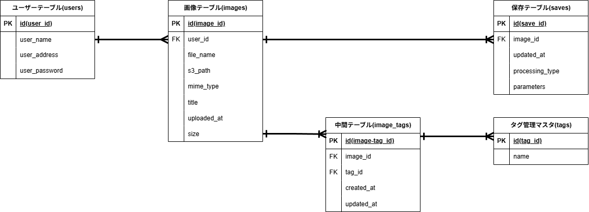

# データベース設計 v.1.0.0

## 更新履歴
- **2026-05-12**: 初版作成

## ER図

    

## ユーザーテーブル(users)
| 論理名 | カラム名 | データ型 | 備考 |
| :-- | :-- | :-- | :-- |
| ユーザーID | id | bigint(unsigned) | PK, Not Null |
| ユーザー名 | user_name | varchar(15) | - |
| メールアドレス | user_address | varchar(50) | - |
| パスワード | user_password | varchar(255) | ^[ -~]*$(英大文字、小文字、数字、記号を混在させること) |

## 画像テーブル(images)
| 論理名 | カラム名 | データ型 | 備考 |
| :-- | :-- | :-- | :-- |
| 画像ID | id | bigint(unsigned) | PK, Not Null |
| 著者ID | user_id | bigint(unsigned) | FK(usersのidを参照), Not Null |
| ファイル名 | file_name | varchar | - |
| 相対パス | s3_path | text | Not Null |
| タイプ | mime_type | varchar(50) | - |
| タイトル | title | varchar | - |
| アップロード日時 | created_at | timestamp | - |
| ファイルサイズ | size | bigint | - | 

## タグ管理マスタ(tags)
| 論理名 | カラム名 | データ型 | 備考 |
| :-- | :-- | :-- | :-- |
| タグID | id | bigint(unsigned) | PK |
| タグ名 | name | varchar(50) | Unique |

## 中間テーブル(image_tags)
| 論理名 | カラム名 | データ型 | 備考 |
| :-- | :-- | :-- | :-- |
| ID | id | bigint(unsigned) | PK |
| 画像ID | image_id | bigint(unsigned) | FK(imagesのidを参照) |
| タグID | tag_id | bigint(unsigned) | FK(tagsのidを参照) |
| 作成日時 | created_at | timestamp | - |
| 更新日時 | updated_at | timestamp | - | 

## 保存テーブル(saves)
| 論理名 | カラム名 | データ型 | 備考 |
| :-- | :-- | :-- | :-- |
| 保存ID | id | bigint(unsigned) | PK, Not Null |
| 画像ID | image_id | bigint(unsigned) | FK(imagesのidを参照), Not Null |
| 更新日時 | updated_at | timestamp | - |
| 加工タイプ | processing_type | varchar(50) | - |
| 加工パラメータ | parameters | text | - | 

