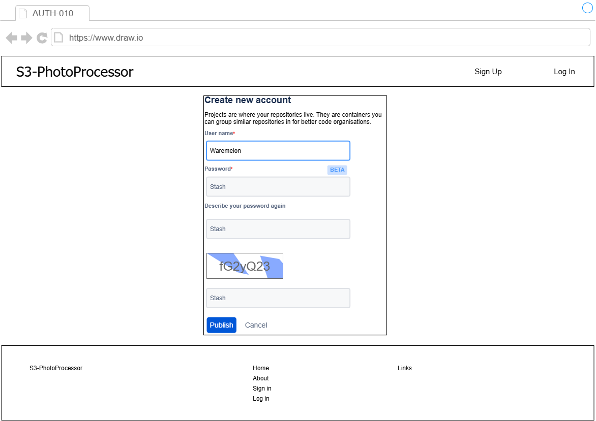

# S3-PhotoProcessor -サインアップ画面仕様書- v.1.0.0

## 更新履歴
- **2026-05-07**: 初版作成

## 画面レイアウト

    

- ユーザーが新規利用開始のため、ユーザー情報を入力する画面。
- トップページのメニュー、またはヘッダーの「Sign Up」ボタンを押すことで遷移する。

## 画面項目定義
| No. | 項目名 | 項目種別 | 項目ラベルID | タブ順 | I/O | データ型 | 表示タイミング | 横位置 | 縦位置 | 備考 |
| :-- | :-- | :-- | :-- | :-- | :-- | :-- | :-- | :-- | :-- | :-- |
| 1 | 画面タイトル | label | - | 10 | O | string | 初期表示 | left | top | - |
| 2 | サインアップボタン | button | - | 20 | I | - | 初期表示 | right | top | ヘッダ埋め込み。 |
| 3 | ログインボタン | button | - | 30 | I | - | 初期表示 | right | top | ヘッダ埋め込み。 |
| 4 | サインアップウインドウ | list | - | - | I/O | - | 初期表示 | center | middle | - |
| 5 | 新規ユーザー名入力ウインドウ | name | - | 40 | I | string | 初期表示 | center | middle | 希望ユーザー名入力。 |
| 6 | 新規パスワード入力ウインドウ | password | - | 50 | I | string | 初期表示 | center | middle | 希望パスワード入力。 |
| 7 | パスワード再入力ウインドウ | password | - | 60 | I | string | 初期表示 | center | middle | パスワード再入力。 |
| 8 | キャプチャ | captcha | - | - | O | - | 初期表示 | center | middle | 認証用画像 |
| 9 | キャプチャ入力ウインドウ | text | - | 70 | I | string | 初期表示 | center | middle | キャプチャ文字入力。 |
| 10 | パブリッシュボタン | button | - | 80 | I | - | 初期表示 | center | middle | アカウント作成試行。 |
| 11 | キャンセルボタン | button | - | 90 | I | - | 初期表示 | center | middle | 入力内容リセット。 |
| 12 | フッタ | list | - | - | I/O | string | 初期表示 | center | bottom | - |
| 13 | サービス名 | label | - | - | O | string | 初期表示 | left | bottom | - |
| 14 | ホームリンク | link | - | - | I/O | string | 初期表示 | center | bottom | - |
| 15 | アバウトリンク | link | - | - | I/O | string | 初期表示 | center | bottom | - |
| 16 | サインアップリンク | link | - | - | I/O | string | 初期表示 | center | bottom | - |
| 17 | ログインリンク | link | - | - | I/O | string | 初期表示 | center | bottom | - |
| 18 | リンクページ | link | - | - | I/O | string | 初期表示 | right | bottom | 外部ページへのリンク画面へ遷移。 |

## 画面項目属性定義
| No. | 項目名 | 項目種別 | 文字種 | フォーマット | 必須 | 最小文字数 | 最大文字数 | 最小byte数 | 最大byte数 | 範囲最小数 | 範囲最大数 |
| :-- | :-- | :-- | :-- | :-- | :-- | :-- | :-- | :-- | :-- | :-- | :-- |
| 1 | ユーザー名 | name | UTF-8 | [a-z0-9_]{6,20}(半角英数字アンダースコアのみ) | y | 6 | 20 | - | - | - | - |
| 2 | パスワード | password | UTF-8 | ^[ -~]*$(英大文字、小文字、数字、記号を混在させること) | y | 10 | - | - | - | - | - |

## 画面項目入力チェック・バリデーション定義
| No. | チェック/バリデーション名 | 対象項目名 | 項目種別 | Client/Server | チェックタイミング | 判定条件 | メッセージID |
| :-- | :-- | :-- | :-- | :-- | :-- | :-- | :-- |
| 1 | ユーザー名必須入力チェック | ユーザー名 | text | Client | submit | ユーザIDが入力されていることをチェックする。入力されていない場合はエラーメッセージを表示する。 | - |
| 2 | パスワード必須入力チェック | パスワード | text | Client | submit | パスワードが入力されていることをチェックする。入力されていない場合はエラーメッセージを表示する。 | - |
| 3 | パスワード一致チェック | パスワード | text | Client | submit | パスワードと再入力パスワードが一致していることをチェックする。一致していない場合はエラーメッセージを表示する。 |
| 4 | キャプチャチェック | キャプチャ | text | Server | submit | 表示されたキャプチャ画像の文字列が正しく入力されているかをチェックする。一致しない場合はエラーメッセージを表示する。 |

## 画面イベント定義
| No. | アクション名 | イベント名 | 対象項目名 | 項目種別 | イベントタイミング | イベント処理内容 |
| :-- | :-- | :-- | :-- | :-- | :-- | :-- |
| 1 | サインアップ | サインアップ時の入力チェック | パブリッシュボタン | button | leftClick | 入力項目についてバリデーション仕様の通りチェックする。 |
| 2 | サインアップ | サインアップ | パブリッシュボタン　| button | sunmit | データベースに新規アカウントを作成する。 |
| 3 | 遷移 | ホーム画面へ遷移 | ホームリンク | link | click | ホーム画面へ遷移する。 |
| 4 | 遷移 | 概要画面へ遷移　 | アバウトリンク | link | click | 概要画面へ遷移する。 |
| 5 | 遷移 | 新規登録画面へ遷移 | サインアップボタン（ヘッダ） | button | click | 新規登録画面へ遷移する。 |
|   |   |   | サインアップリンク（フッタ） | link | click | 新規登録画面へ遷移する。|
| 6 | 再読み込み | 当該画面（SL0002）を再読み込み | ログインボタン（ヘッダ） | button | click | SL0001画面を再読み込みする。 |
|   |   |   | ログインリンク（フッタ） | link | click | SL0001画面を再読み込みする。 |

