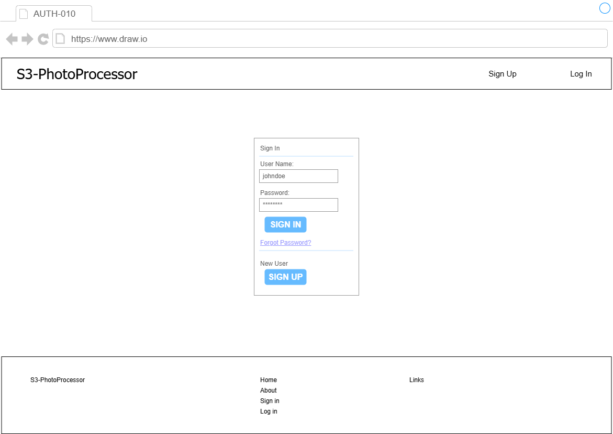

# S3-PhotoProcessor -ログイン画面仕様書- v.1.0.0

## 更新履歴
- **2026-05-01**: 初版作成

## 画面レイアウト

    

- ユーザーがマイページにログインする画面、新規利用の場合はユーザー情報登録画面へ遷移する画面。
- トップページのメニュー、またはヘッダーの「Sign in」ボタンを選択することで本ページへ遷移する。
- サービスを利用するために、マイページにログインするユーザーがアクセスする。

## 画面項目定義
| No. | 項目名 | 項目種別 | 項目ラベルID | タブ順 | I/O | データ型 | 表示タイミング | 横位置 | 縦位置 | 備考 |
| :-- | :-- | :-- | :-- | :-- | :-- | :-- | :-- | :-- | :-- | :-- |
| 1 | 画面タイトル | label | - | 10 | O | string | 初期表示 | left | top | - |
| 2 | サインアップボタン | button | - | 20 | I | - | 初期表示 | right | top | ヘッダ埋め込み。 |
| 3 | ログインボタン | button | - | 30 | I | - | 初期表示 | right | top | ヘッダ埋め込み。 |
| 4 | サインインウインドウ | list | - | - | I/O | - | 初期表示 | center | middle | - |
| 5 | ユーザー名 | name | - | 40 | I | string | 初期表示 | center | middle | 登録ユーザー名入力。 |
| 6 | パスワード | password | - | 50 | I | string | 初期表示 | center | middle | 登録パスワード入力。 |
| 7 | サインインボタン | button | - | 60 | I | - | 初期表示 | center | middle | ログイン試行。 |
| 8 | パスワードリセット | link | - | 70 | I/O | string | 初期表示 | center | middle | パスワード再設定画面へ遷移。 |
| 9 | サインアップボタン-2 | button | - | 80 | I | - | 初期表示 | center | middle | 新規ユーザー情報登録画面へ遷移。 |
| 10 | フッタ | list | - | - | I/O | string | 初期表示 | center | bottom | - |
| 11 | サービス名 | label | - | - | O | string | 初期表示 | left | bottom | - |
| 12 | ホームリンク | link | - | - | I/O | string | 初期表示 | center | bottom | - |
| 13 | アバウトリンク | link | - | - | I/O | string | 初期表示 | center | bottom | - |
| 14 | サインアップリンク | link | - | - | I/O | string | 初期表示 | center | bottom | - |
| 15 | ログインリンク | link | - | - | I/O | string | 初期表示 | center | bottom | - |
| 16 | リンクページ | link | - | - | I/O | string | 初期表示 | right | bottom | 外部ページへのリンク画面へ遷移。 |

## 画面項目属性定義
| No. | 項目名 | 項目種別 | 文字種 | フォーマット | 必須 | 最小文字数 | 最大文字数 | 最小byte数 | 最大byte数 | 範囲最小数 | 範囲最大数 |
| :-- | :-- | :-- | :-- | :-- | :-- | :-- | :-- | :-- | :-- | :-- | :-- |
| 1 | ユーザー名 | name | UTF-8 | [a-z0-9_]{6,20}(半角英数字アンダースコアのみ) | y | 6 | 20 | - | - | - | - |
| 2 | パスワード | password | UTF-8 | ^[ -~]*$(英大文字、小文字、数字、記号を混在させること) | y | 10 | - | - | - | - | - |
 
## 画面項目入力チェック・バリデーション定義
| No. | チェック/バリデーション名 | 対象項目名 | 項目種別 | Client/Server | チェックタイミング | 判定条件 | メッセージID |
| :-- | :-- | :-- | :-- | :-- | :-- | :-- | :-- |
| 1 | ユーザー名必須入力チェック | ユーザー名 | text | Client | submit | ユーザIDが入力されていることをチェックする。入力されていない場合はエラーメッセージを表示する。 | - |
| 2 | パスワード必須入力チェック | パスワード | text | Client | submit | パスワードが入力されていることをチェックする。入力されていない場合はエラーメッセージを表示する。 | - |

## 画面イベント定義
| No. | アクション名 | イベント名 | 対象項目名 | 項目種別 | イベントタイミング | イベント処理内容 |
| :-- | :-- | :-- | :-- | :-- | :-- | :-- |
| 1 | サインイン | サインイン時の入力チェック | サインインボタン | button | leftClick | 入力項目についてバリデーション仕様の通りチェックする。 |
| 2 | サインイン | サインイン | サインインボタン　| button | sunmit | データベースにサインインする。 |
| 3 | 遷移 | ホーム画面へ遷移 | ホームリンク | link | click | ホーム画面へ遷移する。 |
| 4 | 遷移 | 概要画面へ遷移　 | アバウトリンク | link | click | 概要画面へ遷移する。 |
| 5 | 遷移 | 新規登録画面へ遷移 | サインアップボタン（ヘッダ） | button | click | 新規登録画面へ遷移する。 |
|   |   |   | サインアップリンク（フッタ） | link | click | 新規登録画面へ遷移する。|
| 6 | 再読み込み | 当該画面（SL0002）を再読み込み | ログインボタン（ヘッダ） | button | click | SL0002画面を再読み込みする。 |
|   |   |   | ログインリンク（フッタ） | link | click | SL0002画面を再読み込みする。 |

## 画面編集仕様（ログインイベント時）
| No. | 項目名 | 項目種別 | 取得元テーブル名/設定ファイル | 取得元テーブル項目名/固定値 | 編集仕様 |
| :-- | :-- | :-- | :-- | :-- | :-- |
| 1 | ユーザー名 | text | user_name | user_name | ログインユーザーのユーザー名を保持する。 |
| 2 | パスワード | text | password | password | ログインユーザーのパスワードを保持する。 |

## 画面更新仕様（ログインイベント時）
| No. | 項目名 | 項目種別 | 保存先テーブル名 | 保存先テーブル項目名 | 更新仕様 |
| :-- | :-- | :-- | :-- | :-- | :-- |
| 1 | ユーザー名 | label | user | user_name | データベースを参照して認証する。 |
| 2 | パスワード | label | user | password | データベースを参照して認証する。 |

## 画面項目権限マトリクス
| No. | 項目名 | 項目種別 | 管理者権限 | 一般ユーザー権限 |
| :-- | :-- | :-- | :-- | :-- |
| 1 | ユーザー名 | text | 表示可/編集可 | 表示可/編集可 |
| 2 | パスワード | text | 表示可/編集可 | 表示可/編集可 |