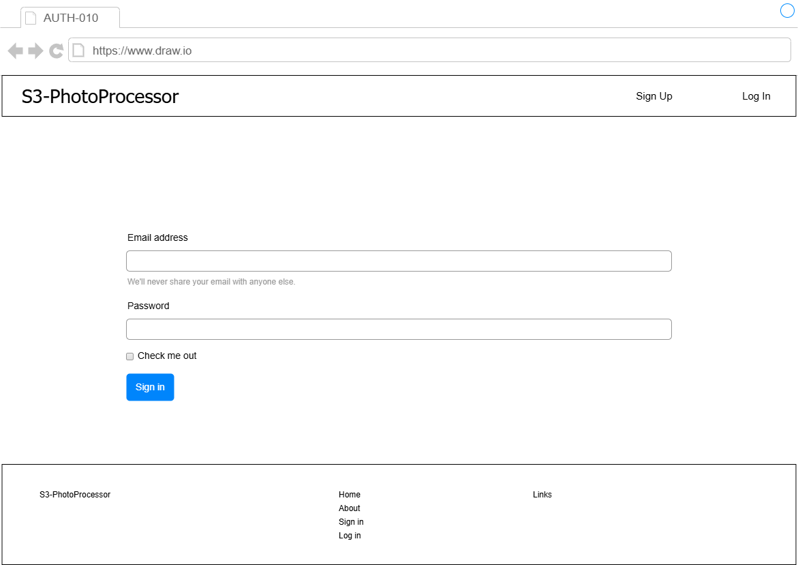

# S3-PhotoProcessor -パスワードリセット画面仕様書- v.1.0.0

## 更新履歴
- **2026-05-07**: 初版作成

## 画面レイアウト

    

- ユーザーがパスワードを忘れた際に、パスワードをリセットし再設定するための画面。
- ログイン画面から「forgot your password?」のリンクをクリックすることで遷移する。

## 画面項目定義
| No. | 項目名 | 項目種別 | 項目ラベルID | タブ順 | I/O | データ型 | 表示タイミング | 横位置 | 縦位置 | 備考 |
| :-- | :-- | :-- | :-- | :-- | :-- | :-- | :-- | :-- | :-- | :-- |
| 1 | 画面タイトル | label | - | 10 | O | string | 初期表示 | left | top | - |
| 2 | サインアップボタン | button | - | 20 | I | - | 初期表示 | right | top | ヘッダ埋め込み。 |
| 3 | ログインボタン | button | - | 30 | I | - | 初期表示 | right | top | ヘッダ埋め込み。 |
| 4 | メールアドレス入力ウィンドウ | address | - | 40 | I | - | 初期表示 | center | middle | 登録メールアドレス入力。 |
| 5 | 認証コード入力ウインドウ | text | - | 40 | I | - | 初期表示 | center | middle | メールアドレスに届いた認証コードを入力。 |
| 6 | 認証ボタン | button | - | 50 | I | - | 初期表示 | center | middle | メールアドレス認証。|
| 7 | 新規パスワード入力ウインドウ | text | - | 60 | I | - | 認証後表示 | center | middle | 新規パスワード入力。 |
| 8 | パスワード再入力ウインドウ | text | - | 60 | I | - | 認証後表示 | center | middle | 新規パスワード再入力。 |
| 9 | 登録ボタン | button | - | 70 | I | - | 認証後表示 | center | middle | パスワード再登録。 |
| 10 | フッタ | list | - | - | I/O | string | 初期表示 | center | bottom | - |
| 11 | サービス名 | label | - | - | O | string | 初期表示 | left | bottom | - |
| 12 | ホームリンク | link | - | - | I/O | string | 初期表示 | center | bottom | - |
| 13 | アバウトリンク | link | - | - | I/O | string | 初期表示 | center | bottom | - |
| 14 | サインアップリンク | link | - | - | I/O | string | 初期表示 | center | bottom | - |
| 15 | ログインリンク | link | - | - | I/O | string | 初期表示 | center | bottom | - |
| 16 | リンクページ | link | - | - | I/O | string | 初期表示 | right | bottom | 外部ページへのリンク画面へ遷移。 |