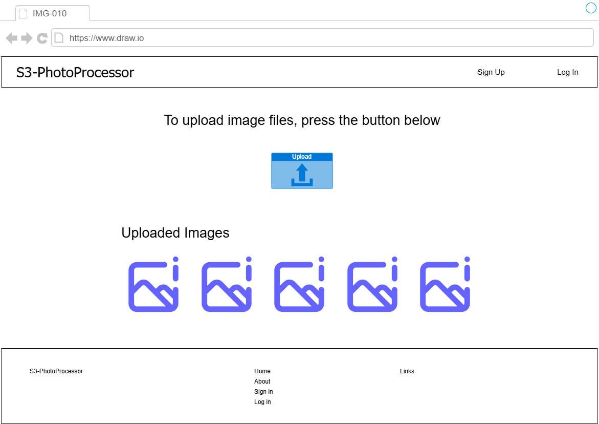

# S3-PhotoProcessor -画像アップロード画面仕様書- v.1.0.0

## 更新履歴
- **2026-05-08**: 初版作成

## 画面レイアウト

    

- ログイン済みユーザーが画像ファイルをアップロードするためにアクセスする。
- アップロードボタンのほか、直近5件のアップロード済みファイルの画像を取得し表示する。

## 画面項目定義
| No. | 項目名 | 項目種別 | 項目ラベルID | タブ順 | I/O | データ型 | 表示タイミング | 横位置 | 縦位置 | 備考 |
| :-- | :-- | :-- | :-- | :-- | :-- | :-- | :-- | :-- | :-- | :-- |
| 1 | 画面タイトル | label | - | 10 | O | string | 初期表示 | left | top | - |
| 2 | サインアップボタン | button | - | 20 | I | - | 初期表示 | right | top | ヘッダ埋め込み。 |
| 3 | ログインボタン | button | - | 30 | I | - | 初期表示 | right | top | ヘッダ埋め込み。 |
| 4 | ナビゲーション1 | label | - | - | O | string | 初期表示 | center | middle | アップロードボタンへの案内メッセージ。 |
| 5 | アップロードボタン | button | - | 40 | I/O | - | 初期表示 | center | middle | 画像アップロードポップアップを起動。 |
| 6 | ナビゲーション2 | label | - | - | O | string | 初期表示 | center | middle | 一覧表示の案内メッセージ。 |
| 7 | アップロード済み画像1~5 | image | - | 50 ~ 90 | O | 初期表示 | center | middle | 直近5件のアップロード済み画像。 |
| 8 | フッタ | list | - | - | I/O | string | 初期表示 | center | bottom | - |
| 9 | サービス名 | label | - | - | O | string | 初期表示 | left | bottom | - |
| 10 | ホームリンク | link | - | - | I/O | string | 初期表示 | center | bottom | - |
| 11 | アバウトリンク | link | - | - | I/O | string | 初期表示 | center | bottom | - |
| 12 | サインアップリンク | link | - | - | I/O | string | 初期表示 | center | bottom | - |
| 13 | ログインリンク | link | - | - | I/O | string | 初期表示 | center | bottom | - |
| 14 | リンクページ | link | - | - | I/O | string | 初期表示 | right | bottom | 外部ページへのリンク画面へ遷移。 |