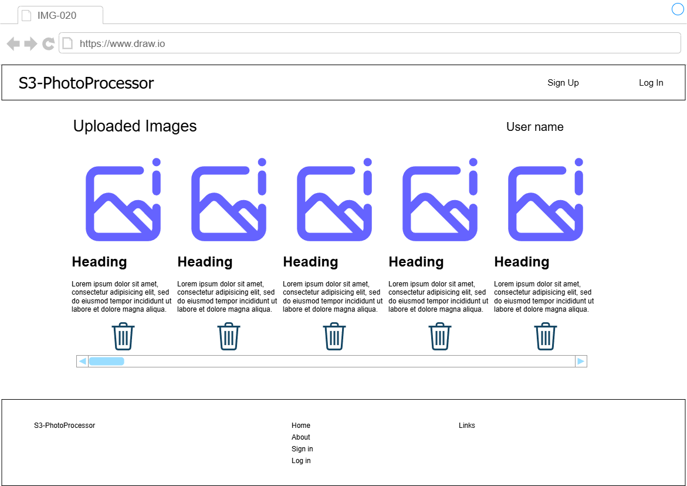

# S3-PhotoProcessor -画像一覧表示画面仕様書- v.1.0.0

## 更新履歴
- **2026-05-11**: 初版作成

## 画面レイアウト

    

- ログイン済みユーザーがアップロードした画像と、その情報を一覧表示。
- 水平スクロールバーで5枚以上の画像を表示。
- 画像プロパティ下部のデリートボタンで画像の削除が可能。

## 画面項目定義
| No. | 項目名 | 項目種別 | 項目ラベルID | タブ順 | I/O | データ型 | 表示タイミング | 横位置 | 縦位置 | 備考 |
| :-- | :-- | :-- | :-- | :-- | :-- | :-- | :-- | :-- | :-- | :-- |
| 1 | 画面タイトル | label | - | 10 | O | string | 初期表示 | left | top | - |
| 2 | サインアップボタン | button | - | 20 | I | - | 初期表示 | right | top | ヘッダ埋め込み。 |
| 3 | ログインボタン | button | - | 30 | I | - | 初期表示 | right | top | ヘッダ埋め込み。 |
| 4 | ナビゲーション | label | - | - | O | string | 初期表示 | center | middle | 一覧表示の案内メッセージ。 |
| 5 | アップロード済み画像 | image | - | 40 ~ | I/O | - | 初期表示 | center | middle | アップロード済み画像のサムネイル表示。 |
| 6 | 画像プロパティ | text | - | - | O | string | 初期表示 | center | middle | 画像情報のテキスト表示。 |
| 7 | デリートボタン | button | - | 50 ~ | I | - | 初期表示 | center | middle | アップロード済み画像の削除ボタン。 |
| 8 | スクロールバー | scroll | - | - | I | - | 初期表示 | center | middle | 画像スクロールバー。 |
| 9 | フッタ | list | - | - | I/O | string | 初期表示 | center | bottom | - |
| 10 | サービス名 | label | - | - | O | string | 初期表示 | left | bottom | - |
| 11 | ホームリンク | link | - | - | I/O | string | 初期表示 | center | bottom | - |
| 12 | アバウトリンク | link | - | - | I/O | string | 初期表示 | center | bottom | - |
| 13 | サインアップリンク | link | - | - | I/O | string | 初期表示 | center | bottom | - |
| 14 | ログインリンク | link | - | - | I/O | string | 初期表示 | center | bottom | - |
| 15 | リンクページ | link | - | - | I/O | string | 初期表示 | right | bottom | 外部ページへのリンク画面へ遷移。 |