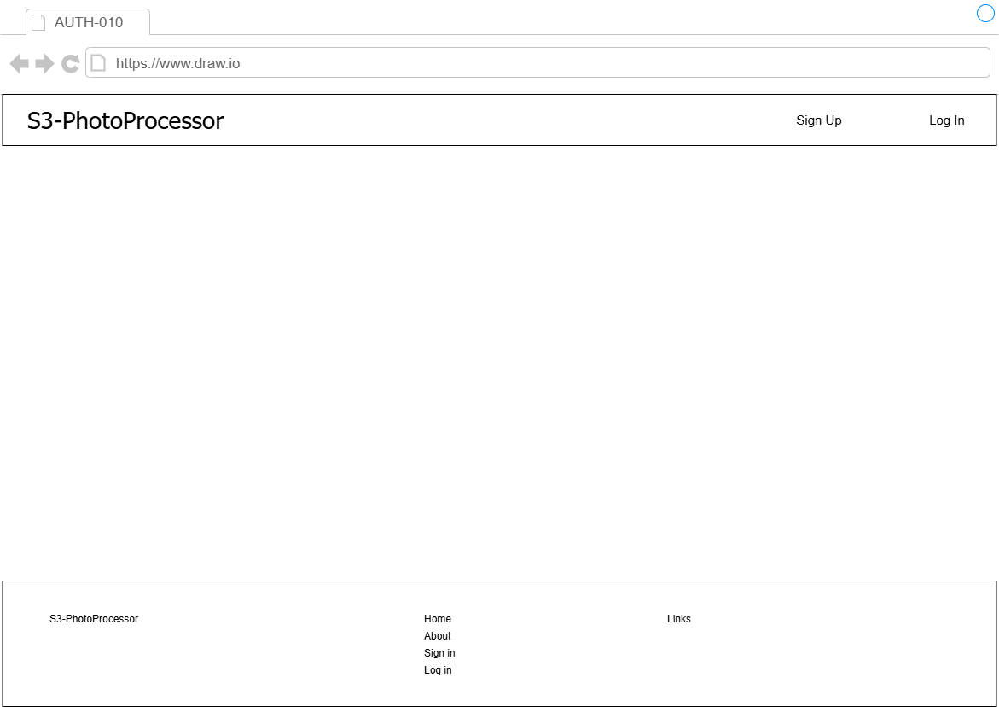

# S3-PhotoProcessor -画面仕様書:共通レイアウト- v.1.0.0

## 更新履歴
- **2026-05-01**: 初版作成

## 画面共通レイアウト

    

- 共通事項はヘッダとフッタの内容。
- ヘッダ部にログインボタンと、初回登録のためのサインアップボタンを配置。
- フッタ部にはサイトマップのような形で、サービスの他のページへ遷移可能なボタン/リンクを配置。