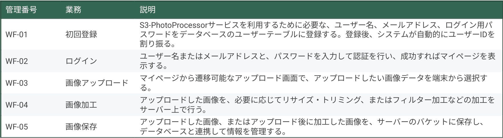
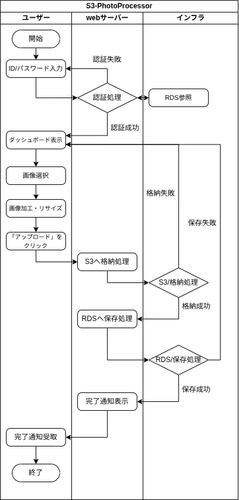
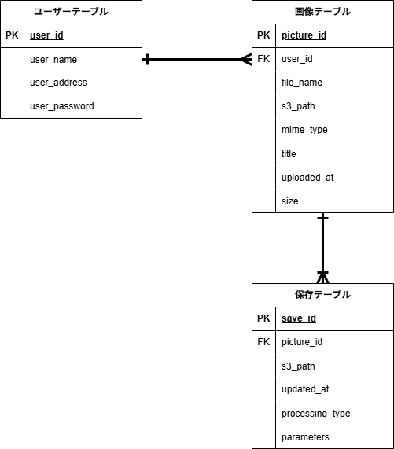
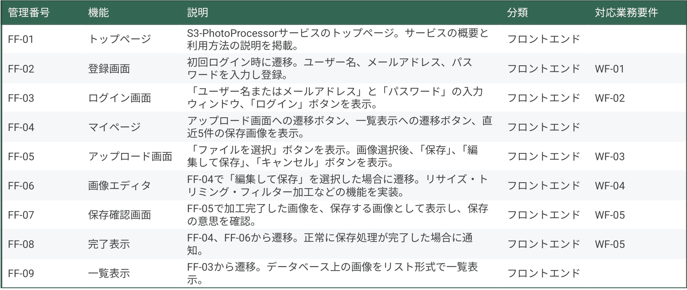

# 1. プロジェクト概要
システム構成図

  

## 1.1 開発の目的
- スマートフォンのカメラ機能の性能向上に伴い、画像・写真のデータサイズが大きくなることで、端末のストレージを圧迫することが、今後より想定される。
- クラウド上に写真をアップロードすることで、端末上での写真データの管理の必要をなくし、ユーザーの利便性の向上を図る。
- クラウド上のリソースを活用して、端末上では高い負荷がかかる画像の加工処理を行う機能を実装することで、手軽な画像加工が可能な環境を提供する。

## 1.2 目的の背景
- 過去にLAMP/LEMP環境の構築を完遂。
→http://www.github.com/yskamio-yc/LEMP_Laravel_test.git
- 次のステップとして、フロントエンド機能の実装を通じた「インフラ上で動作するアプリ」の挙動を深く理解する必要があるため。
- 過去プロジェクトで実装したS3、RDSと、画像保存・加工機能の相性がいいと判断したため。

# 2. 業務要件
## 2.1 業務要件（一覧）

  

## 2.2 業務フロー
業務フロー図

  

- ユーザーはログイン後、「マイページ」からアップロード画面へ遷移。
- 「ファイルを選択」→「アップロード」で画像を保存。
- マイページ、およびアップロード完了通知画面で、アップロード済み画像の一覧を表示する。

## 2.3 データベース設計
ER図

  

- ユーザー情報は「ユーザーテーブル」で管理を行う。user_idを、レコードを一意に定める主キーとし、user_name(表示名)、user_address(メールアドレス)、user_password(パスワード)を紐づけて管理する。
- 「画像テーブル」には、初回アップロード時の画像に関する情報を格納し、画像加工画面での画像呼び出しに用いる。
- 「保存テーブル」には、アップロードされた画像の加工・変更履歴を主に格納し、バージョン管理を行う。「保存テーブル」には、アップロードされた画像の加工・変更履歴を主に格納し、バージョン管理を行う。

# 3. 機能要件
- フロントエンド

  

