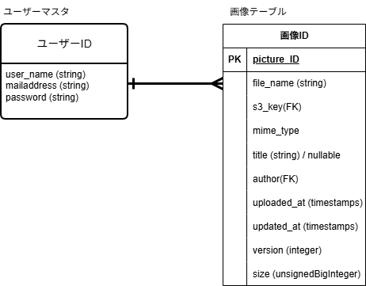

# 1. プロジェクト概要
システム構成図

## 1.1 開発の目的
- 自作のLEMP環境パッケージを活用した、実践的なWebアプリケーション開発スキルの習得。
- LocalStack（S3/RDS）を用いたクラウドネイティブなインフラ操作の実践。
- S3、RDSの特性を活かしたアプリ開発を通して、要件とインフラ選定の対応を学ぶ。

## 1.2 目的の背景
- 過去にLAMP/LEMP環境の構築を完遂。
→http://www.github.com/yskamio-yc/LEMP_Laravel_test.git
- 次のステップとして、フロントエンド機能の実装を通じた「インフラ上で動作するアプリ」の挙動を深く理解する必要があるため。
- 過去プロジェクトで実装したS3、RDSと、画像保存・加工機能の相性がいいと判断したため。

# 2. 業務要件
## 2.1 業務フロー
業務フロー図

- ユーザーはログイン後、「マイページ」からアップロード画面へ遷移。
- 「ファイルを選択」→「アップロード」で画像を保存。
- マイページ、およびアップロード完了通知画面で、アップロード済み画像の一覧を表示する。

## 2.2 データベース設計
ER図

