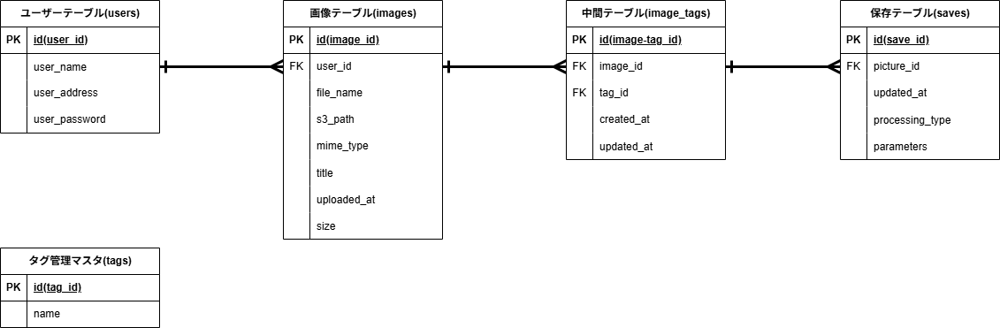

# 1. プロジェクト概要
システム構成図

  

## 1.1 開発の目的
- スマートフォンのカメラ機能の性能向上に伴い、画像・写真のデータサイズが大きくなることで、端末のストレージを圧迫することが、今後より想定される。
- クラウド上に写真をアップロードすることで、端末上での写真データの管理の必要をなくし、ユーザーの利便性の向上を図る。
- クラウド上のリソースを活用して、端末上では高い負荷がかかる画像の加工処理を行う機能を実装することで、手軽な画像加工が可能な環境を提供する。

## 1.2 目的の背景
- 過去にLAMP/LEMP環境の構築を完遂。
→http://www.github.com/yskamio-yc/LEMP_Laravel_test.git
- 次のステップとして、フロントエンド機能の実装を通じた「インフラ上で動作するアプリ」の挙動を深く理解する必要があるため。
- 過去プロジェクトで実装したS3、RDSと、画像保存・加工機能の相性がいいと判断したため。

# 2. 業務要件
## 2.1 業務要件（一覧）

| 管理番号 | 業務 | 説明 |
| :-- | :-- | :-- |
| WF-01 | 初回登録 | S3-PhotoProcessorサービスを利用するために必要な、ユーザー名、メールアドレス、ログインパスワードをデータベースのユーザーテーブルに登録する。登録後、システムが自動的にユーザーIDを割り振る。 |
| WF-02 | ログイン | ユーザー名またはメールアドレスと、パスワードを入力して認証を行い、成功すればマイページ（画像一覧表示画面）を表示する。 |
| WF-03 | 画像アップロード | マイページから遷移可能なアップロード画面で、アップロードしたい画像データを端末から選択し、アップロードする。 |
| WF-04 | 画像加工 | アップロードした画像を、必要に応じてリサイズ・トリミング、またはフィルター加工などの処理をサーバー上で行う。 |
| WF-05 | 画像保存 | アップロードした画像、またはアップロード後に加工した画像を、サーバーのバケットに格納し、データベースと連携して情報を管理する。 |

## 2.2 業務フロー
業務フロー図

  

- ユーザーはログイン後、「マイページ」からアップロード画面へ遷移。
- 「ファイルを選択」→「アップロード」で画像を保存。
- マイページ、およびアップロード完了通知画面で、アップロード済み画像の一覧を表示する。

## 2.3 データベース設計
ER図

  

- ユーザー情報は「ユーザーテーブル」で管理を行う。user_idを、レコードを一意に定める主キーとし、user_name(表示名)、user_address(メールアドレス)、user_password(パスワード)を紐づけて管理する。
- 「画像テーブル」には、初回アップロード時の画像に関する情報を格納し、画像加工画面での画像呼び出しに用いる。
- 「保存テーブル」には、アップロードされた画像の加工・変更履歴を主に格納し、バージョン管理を行う。「保存テーブル」には、アップロードされた画像の加工・変更履歴を主に格納し、バージョン管理を行う。
- 「中間テーブル」は、「多対多」の関係になる画像テーブルと保存テーブルの間を、タグマスタで管理するタグナンバーを仲介して結びつける役割を果たす。

# 3. 機能要件
- フロントエンド

| 管理番号 | 機能 | 説明 | 分類 | 対応画面 |
| :-- | :-- | :-- | :-- | :-- |
| FF-01 | トップページ | S3-PhotoProcessorサービスのトップページ。サービスの概要と利用方法の説明を掲載。 | フロントエンド | SL0000 |
| FF-02 | 登録画面 | 初回ログイン時に遷移。ユーザー名、メールアドレス、パスワードを入力し登録。 | フロントエンド | SL0001 |
| FF-03 | ログイン画面 | 「ユーザー名またはメールアドレス」と「パスワード」の入力ウインドウ、「ログイン」ボタンを表示。 | フロントエンド | SL0002 |
| FF-04 | パスワードリセット | ユーザーがパスワードを忘れた場合、登録メールアドレスを経由してパスワードリセットを行う機能。 | フロントエンド | SL0003 |
| FF-05 | アップロード画面 | 「ファイルを選択」ボタンを表示。画像選択後、「保存」、「編集して保存」、「キャンセル」ボタンを表示。 | フロントエンド | SL0004 |
| FF-06 | 一覧表示 | FF-03から遷移。データベース上の画像と情報をリスト形式で一覧表示する。 | フロントエンド | SL0005 |
| FF-07 | 画像エディタ | FF-05で「編集して保存」を選択した場合に遷移。リサイズ・トリミング・フィルター加工などの機能を実装。 | フロントエンド | SL0006 |

